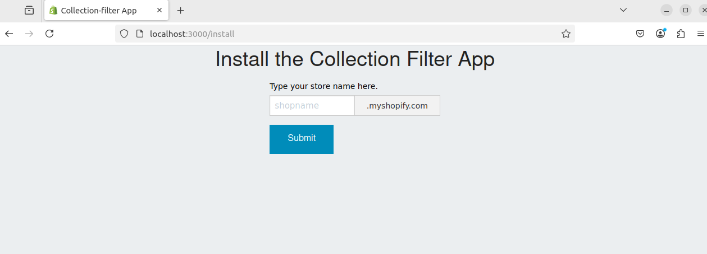

This app is main shopify app of PIKO store with multiple advanced features to support shopify backend.

## Environment
- Node.js (Express framework)
- MongoDB
- Heroku hosting

## Features
- Duplicating the shopify products from shopify database to our MongoDB
- Sorting and filtering the products on collection page, and rendering them
- Size Guide data rendering, Measurement app features.
- Custom account, login, register ...

## How to run

1. npm install
2. npm start
3. http://localhost:3000/

---

## Task 💻

---

Please add Tailwind CSS and apply the basic styles to the install page.

